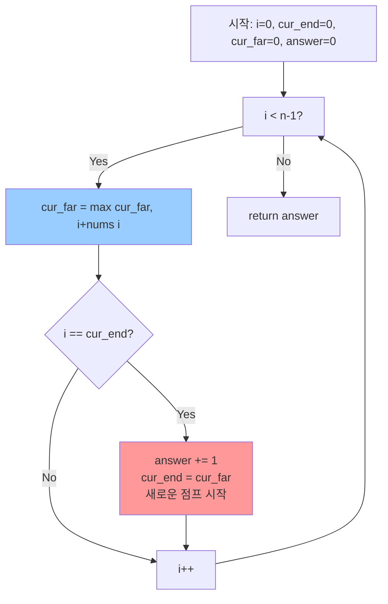
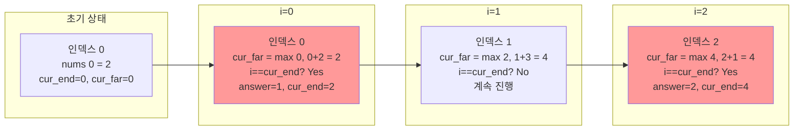
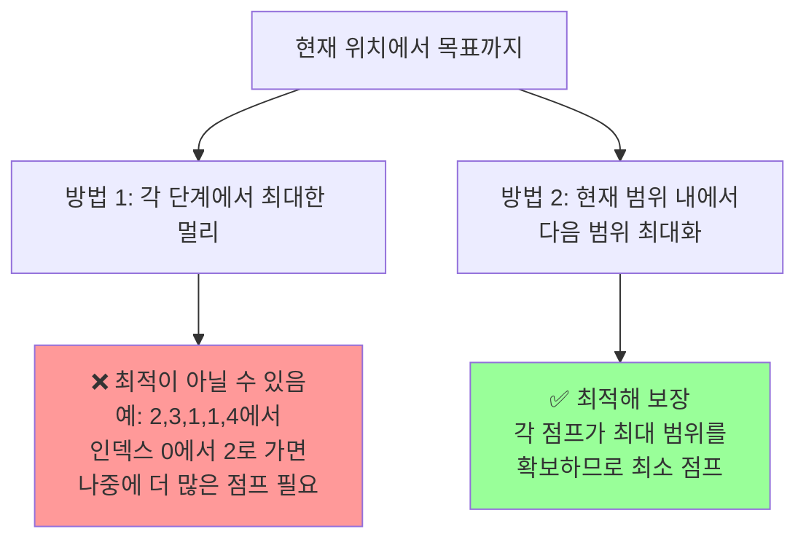

# Jump Game II 알고리즘 설명

## 문제 개요
0번 인덱스에서 시작해서 n-1번 인덱스까지 도달하는 **최소 점프 횟수**를 구하는 문제입니다.

## 알고리즘 핵심 아이디어

이 알고리즘은 **Greedy 알고리즘**으로, 각 단계에서 다음 점프 범위를 최대화하는 방식으로 동작합니다.

### 주요 변수
- `cur_end`: 현재 점프로 도달할 수 있는 가장 먼 인덱스 (현재 점프의 종료 지점)
- `cur_far`: 현재까지 탐색한 모든 인덱스에서 도달할 수 있는 가장 먼 인덱스 (다음 점프 범위)
- `answer`: 점프 횟수

## 왜 최소 점프 횟수가 되는가?

### 핵심 원리
1. **현재 점프 범위 내에서** 다음 점프 범위를 최대화합니다.
2. 현재 점프 범위(`cur_end`)의 끝에 도달했을 때만 새로운 점프를 합니다.
3. 이렇게 하면 각 점프가 최대한 멀리 도달하므로, 전체 점프 횟수가 최소가 됩니다.

### 동작 과정



## 예시로 이해하기

### 예시: nums = [2, 3, 1, 1, 4]



### 단계별 상세 설명

| i | nums[i] | cur_far 업데이트 | i == cur_end? | answer | cur_end | 설명 |
|---|---------|-----------------|---------------|--------|---------|------|
| 0 | 2 | max(0, 0+2) = **2** | Yes (0==0) | **1** | **2** | 첫 점프! 인덱스 0에서 2까지 도달 가능 |
| 1 | 3 | max(2, 1+3) = **4** | No (1≠2) | 1 | 2 | 인덱스 1에서 더 멀리 갈 수 있음 (4까지) |
| 2 | 1 | max(4, 2+1) = **4** | Yes (2==2) | **2** | **4** | 두 번째 점프! 인덱스 2에서 4까지 도달 가능 |
| 3 | 1 | max(4, 3+1) = **4** | No (3≠4) | 2 | 4 | 이미 목표(4)에 도달 가능 |
| - | - | - | - | **2** | - | **결과: 2번 점프** |

## 왜 이 방법이 최소인가?

### 증명 아이디어



### 핵심 논리

1. **현재 점프 범위(`cur_end`) 내의 모든 인덱스**를 탐색하면서, 그 중에서 **가장 멀리 갈 수 있는 지점**을 찾습니다 (`cur_far`).

2. 현재 범위의 끝(`cur_end`)에 도달했을 때만 새로운 점프를 합니다. 이는:
   - 현재 범위 내의 모든 가능성을 고려했기 때문
   - 다음 점프 범위를 최대화했기 때문

3. 만약 더 일찍 점프한다면:
   - 아직 탐색하지 않은 더 좋은 옵션을 놓칠 수 있음
   - 불필요한 점프를 하게 됨

4. 만약 더 늦게 점프한다면:
   - 이미 도달 가능한 범위를 넘어서 점프할 수 없음 (문제 제약)

## 시각적 예시

```
nums = [2, 3, 1, 1, 4]
인덱스:  0  1  2  3  4

초기: cur_end=0, cur_far=0, answer=0
      [0]
       ↓
      시작

i=0:  cur_far = max(0, 0+2) = 2
      i == cur_end (0==0) → 점프!
      answer=1, cur_end=2
      [0]---[1]---[2]
       ↓           ↓
      시작      첫 점프로 도달 가능

i=1:  cur_far = max(2, 1+3) = 4
      i != cur_end (1≠2) → 계속 탐색
      [0]---[1]---[2]
       ↓     ↓     ↓
      시작   탐색중  도달가능
             (4까지 갈 수 있음!)

i=2:  cur_far = max(4, 2+1) = 4
      i == cur_end (2==2) → 점프!
      answer=2, cur_end=4
      [0]---[1]---[2]---[3]---[4]
       ↓           ↓           ↓
      시작      첫점프      두번째점프
                        (목표 도달!)
```

## 시간 복잡도
- **O(n)**: 배열을 한 번만 순회합니다.
- **공간 복잡도**: **O(1)**: 추가 공간을 사용하지 않습니다.

## 결론

이 알고리즘이 최소 점프 횟수를 보장하는 이유:
1. ✅ 각 점프가 **현재 범위 내에서 다음 범위를 최대화**
2. ✅ **필요할 때만** 점프 (cur_end에 도달했을 때)
3. ✅ Greedy 선택이 항상 최적해로 이어짐

이는 **"현재 선택이 미래 선택에 영향을 주지 않으면서, 각 단계에서 최선의 선택을 하는"** 전형적인 Greedy 알고리즘입니다.

