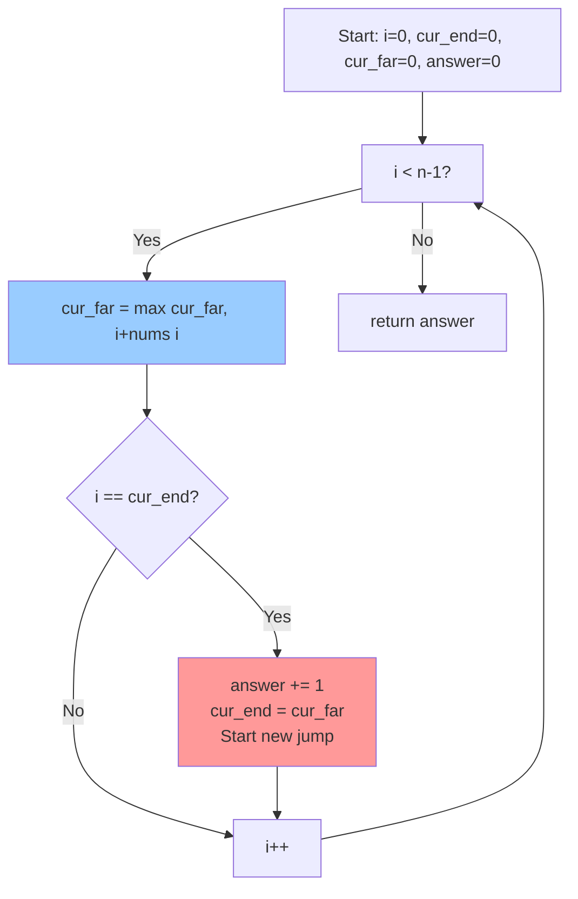
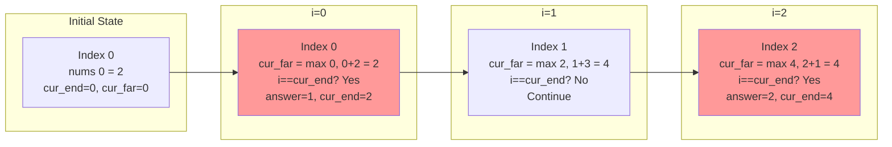
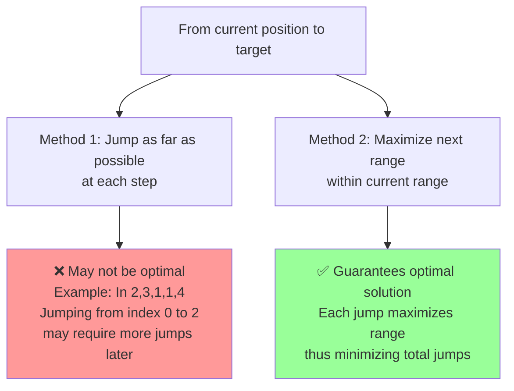

# Jump Game II Algorithm Explanation

## Problem Overview
Given a 0-indexed array of integers `nums` of length `n`, find the **minimum number of jumps** to reach index `n - 1` starting from index 0.

## Core Algorithm Idea

This algorithm is a **Greedy algorithm** that maximizes the next jump range at each step.

### Key Variables
- `cur_end`: The farthest index reachable with the current jump (the end point of the current jump)
- `cur_far`: The farthest index reachable from all indices explored so far (the next jump range)
- `answer`: The number of jumps

## Why Does This Guarantee Minimum Jumps?

### Core Principle
1. **Within the current jump range**, maximize the next jump range.
2. Only make a new jump when reaching the end of the current jump range (`cur_end`).
3. This ensures each jump reaches as far as possible, minimizing the total number of jumps.

### Execution Flow



## Understanding Through Example

### Example: nums = [2, 3, 1, 1, 4]



### Step-by-Step Detailed Explanation

| i | nums[i] | cur_far Update | i == cur_end? | answer | cur_end | Explanation |
|---|---------|----------------|---------------|--------|---------|-------------|
| 0 | 2 | max(0, 0+2) = **2** | Yes (0==0) | **1** | **2** | First jump! Can reach index 2 from index 0 |
| 1 | 3 | max(2, 1+3) = **4** | No (1≠2) | 1 | 2 | Can go further from index 1 (up to index 4) |
| 2 | 1 | max(4, 2+1) = **4** | Yes (2==2) | **2** | **4** | Second jump! Can reach index 4 from index 2 |
| 3 | 1 | max(4, 3+1) = **4** | No (3≠4) | 2 | 4 | Already can reach target (4) |
| - | - | - | - | **2** | - | **Result: 2 jumps** |

## Why Is This Method Optimal?

### Proof Idea



### Core Logic

1. **Explore all indices within the current jump range (`cur_end`)** and find the **farthest reachable point** (`cur_far`).

2. Only make a new jump when reaching the end of the current range (`cur_end`). This is because:
   - We've considered all possibilities within the current range
   - We've maximized the next jump range

3. If we jump earlier:
   - We might miss better options that haven't been explored yet
   - We make unnecessary jumps

4. If we jump later:
   - We cannot jump beyond the already reachable range (problem constraint)

## Visual Example

```
nums = [2, 3, 1, 1, 4]
Index:  0  1  2  3  4

Initial: cur_end=0, cur_far=0, answer=0
         [0]
          ↓
         Start

i=0:  cur_far = max(0, 0+2) = 2
      i == cur_end (0==0) → Jump!
      answer=1, cur_end=2
      [0]---[1]---[2]
       ↓           ↓
      Start    Reachable with first jump

i=1:  cur_far = max(2, 1+3) = 4
      i != cur_end (1≠2) → Continue exploring
      [0]---[1]---[2]
       ↓     ↓     ↓
      Start Exploring Reachable
             (Can reach index 4!)

i=2:  cur_far = max(4, 2+1) = 4
      i == cur_end (2==2) → Jump!
      answer=2, cur_end=4
      [0]---[1]---[2]---[3]---[4]
       ↓           ↓           ↓
      Start    First jump  Second jump
                        (Target reached!)
```

## Time Complexity
- **O(n)**: We traverse the array only once.
- **Space Complexity**: **O(1)**: We use no extra space.

## Conclusion

Why this algorithm guarantees the minimum number of jumps:
1. ✅ Each jump **maximizes the next range within the current range**
2. ✅ Jumps only when **necessary** (when reaching `cur_end`)
3. ✅ Greedy choices always lead to the optimal solution

This is a classic **Greedy algorithm** where "current choices don't affect future choices, and we make the best choice at each step."

